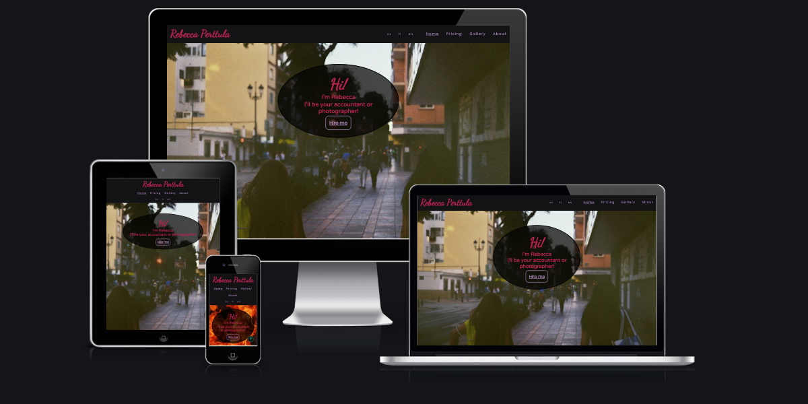

# Portfolio Project 1 - HTML & CSS

## Introduction

## Table of Contents

1. [Site Styling](#main-elements)
    1.1. [Header](#header)
    1.2. [Footer](#footer)
    1.3. [Index](#index)
    1.4. [Pricing](#pricing)
    1.5. [Gallery](#gallery)
    1.6. [Colour Scheme](#colour-scheme)
2. [Testing](#testing)
3. [Bugs](#bugs)
4. [Issues During Testing](#issues-during-testing)
5. [Future Enhancements](#future-enhancements)
6. [Credits](#credits)

## Main Elements

In this section I will be detailing the basic layout decisions regarding the main elements which stay constant regardless of the page, header and footer elements.

### Header

    With the site layout I have generally tried to opt in for relatively simple solutions, but also ones that regardless work as intended. The navigation bar has a logo text on the left side and links to other pages on the right. The links for translations are in a smaller font on the left of the page links. All these links get underlined on hover to make them stand out as links. The current page shown is underlined to make it easier to understand which page one is on. The whole navigation bar is sticky up to a screen width of 804px where I noticed it starts taking out a substantial amount of the screen height and would only end up being in the way for the user. Instead at this width there is a button in the bottom right corner that links to the top of the page in order for the user to still be able to easily access the navigataion bar when needed.

    In the Swedish and Finnish translated navigation bars I did run into an issue regarding the number of characters in the links themselves where in both languages there were more total characters leading to the links stacking prematurely compared to the header height change. I first solved the issue by introducing inline styling in the affected pages but in the end opted to instead give them a specific class with the required styling to eliminate the need for inline styling.

### Footer

    The footer layout is very simple, with only a copyright notice in the middle and a sigil showing my certification within the Swedish Accounting Association (SRF). The height of the footer is the same as of the header when on laptops for consistency - unlike the header it does not resize depending on the screen width due to there not being enough content to necesitate this.

### Index

    The index page does not contain much content and is designed to be a landing page from where the user themselves can choose the information they wish to receive and in what order through browsing the other pages. Its only features are a background image which is different depending on the screen size due to the image in 16:9 aspect ratio losing its foreground elements after a certain screen width. Instead at smaller widths there is an image with a more compatible aspect ratio for viewing on displays where the height is greater than the width. Horizontally in the centre of the image is an opaque dark background oval with the text "Hi! I'm Rebecca, I'll be your accountant or photographer" and a link underneath the text with the caption "Hire me", linking to the page containing pricing information for the business. 

    The text is phrased in a particular way to convey a sense of "semi-professionalism" for a lack of a better wording, meaning that I want the user to know I will be professional but at the same time friendly. In contrast to "Welcome!", "Hi!" does convey a more casual meaning which I see as preferable for my target audience. "Welcome" is also very broadly used in this context, where the use of "Hi" could capture the user's focus better.

### Pricing 

    The first elements on this page are quite naturally tables showing examples of the business' price list, where the data is separated into two columns - "product" and "price". There are two tables due to the business operating under two different categories, accounting and photography. Underneath the tables is a section of text - giving a disclaimer of the tables' content not reflecting the full amount of services offered, containing a link to the contact information section of the about page. Information on the business' donation policy and external shop is also provided here.

### Gallery

    The gallery page is in its entirety only an assortment of photos to act as a photography portfolio, in order for the customers to feel safe in hiring the business for photography. The gallery is a 4-column flexbox which adapts its stacking for the screen width - the maximum amount of columns is 4 but depending on the screen it will be 2 or 1 columns. I ran into issues with the flexbox from the start in the 4 column variation; even though it should have aligned, well one column kept stacking down. I figured out that the issue has to do with padding, which it was, however, it doesn't explain the numerous examples of similar arrangements found online seemingly working without issue. My fix to this was to subtract the amount of side padding in total divided by the amount of columns and use this as the flex and max-width values, which fixed the issue. albeit with 

### Colour Scheme

    For the colour scheme on my site I chose to go with - there is one inconsistency from the colour scheme which is the background colour of the WhatsApp QR code which did not work with any of the colours in the colour scheme, only looking fine with a white background. All colours used are added to the :root of the stylesheet as variables to make navigating between them easier, the white was also added to this to provide consistency in the code despite it not being part of the "chosen" colour scheme for the site.

    In the following photo are the colours used on the site:

    

## Testing
    All of the UI was tested with both Lighthouse and ARC, with both flagging the contrast ratio of the logo text compared to the background as being too low, which I believe to be a false positive. After multiple-user testing, the conclusion has consistently been that it is fully readable. The pages have been put through multiple different colour blindness filters where the text has also been fully readable on each of them. Further evidence of a false positive is that neither of these extensions flag the text on the index page hero photo, where logically the contrast ratio should be registered as lower due to the opaque background. I believe the testing fully disregards the header background colour and instead tests the logo text against the background photo on the index page, which is behind the header and therefore doesn't affect the readability of the text whatsoever.

## Bugs

    There is a minor issue of one column in the gallery page having an amount of top padding I cannot explain at this point. It isn't an issue in terms of usability, but aesthetically it creates an inconsistent amount of gap between two pictures, which for me is a moderate nuisance. I will continue researching what the fault could be and aim to correct this as soon as I am able to.

## Issues During Testing

## Future Enhancements

    There are a few details I would like to improve with the site in the future:

1. **Create a "sandwitch" navigation panel for mobile users**
    I tried to accomplish this with CSS and HTML alone but the search for a solution turned out to be too time consuming for it to be a viable option at this time. Once I am able to use JavaScript to a higher degree it is my plan to make this happen as from my understanding the process is much easier with JavaScript. At this point however my skills aren't good enough in JS to accomplish this but it would eliminate the need for the button to top which could have an impact on user experience through their scroll position not being saved.
2. **Fix the gap between one of the columns in gallery**
    As mentioned before this issue does not impact usability to a significant degree but in the future I would like to fix this as it is somewhat visible and deviates from the consistent padding between the photos generally.
3. **Improve and add translations**
    At this point I am fully aware that the translations of all the pages aren't perfect - they are in a few points transliterated instead of finding a phrasing in the target language that would be equivalent to the English one. They are fully readable in each language however so the only difference would be a somewhat improved user experience. I would also like to translate the site into other languages once I am proficient enough to be able to confidently do this, at this point however, the languages offered will be suitable for the vast majority of the business' target demographies.

## Credits